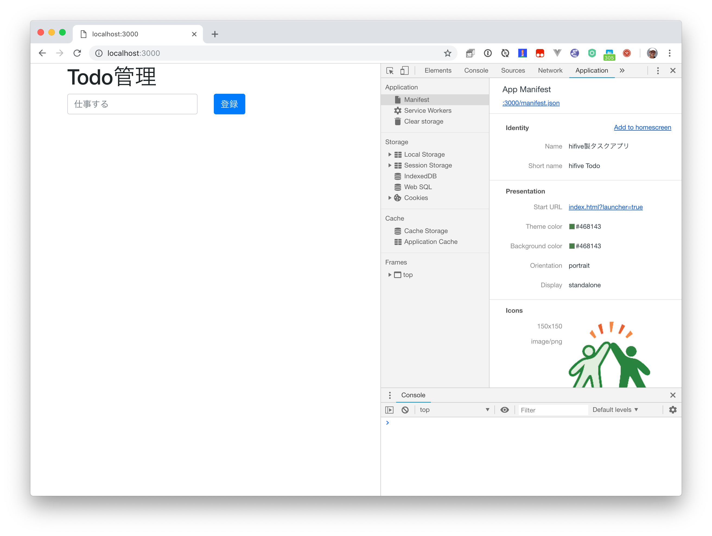
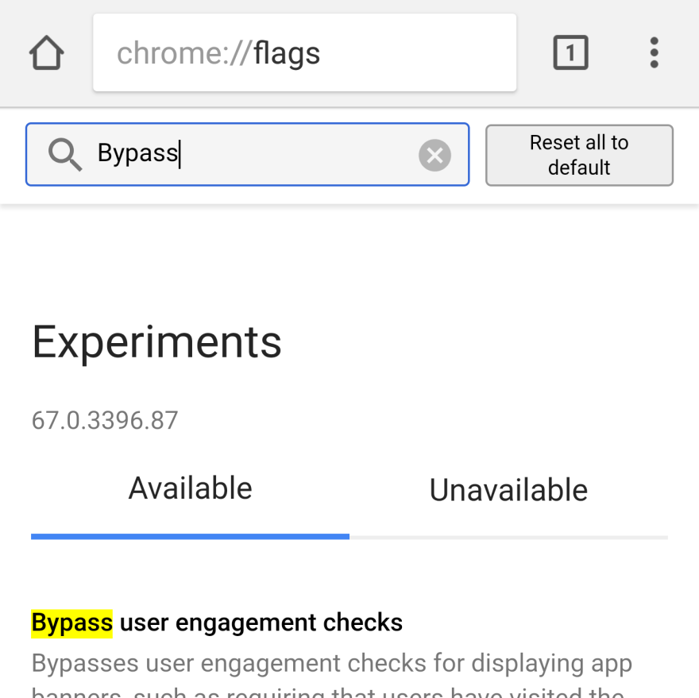

# 第2章 マニフェストファイルを作る

マニフェストファイルはアプリの仕様が書かれたJSONファイルです。多くの場合 manifest.json という名前で作成します。これをHTMLの中で読み込みます。

```html
<link rel="manifest" href="manifest.json">
```

Monacaアプリの場合、デフォルトで記述されています。

> 今回はTodoアプリを作っている最中にインストールされてしまうと問題があるのでコメントアウトしています。アプリ化を体験する際にはコメントアウトを外してください。

## マニフェストファイルの内容

マニフェストファイルは以下のような内容になっています。

| キー | 内容 |
|------|------|
|short_name|短いアプリ名|
|name|アプリ名|
|icons|アイコン。サイズに応じて複数指定可能|
|display|フルスクリーン、スタンドアローン、Webブラウザなど|
|background_color|アプリが立ち上がる際の背景色|
|theme_color|テーマカラー。ヘッダーバーの色の適用|
|orientation|回転方向|
|start_url|PWAを表示する際のURL|

## 内容を確認する

manifest.jsonがきちんと書かれているかどうかは Google Chromeで確認するのが一番簡単です。開発者ツールを開いて、Applicationタブに切り替えます。以下のようにmanifest.jsonファイルの内容が表示されます。



この内容を編集して、Webブラウザで再読込すると表示に反映されます。編集して確認してみましょう。

## Androidで設定を変更する

PWAとしてインストールするか確認するバナー（A2H = Add to Home Screen）は5分以上の時間をおいて、2回目以降のアクセスで表示されます。しかし開発中ではこの状態では不便なので、Google Chromeの設定変更をお勧めします。Androidで `chrome://flags` を開きます。そしてBypass user engagement checksと検索して有効にします。



これで一度目のアクセスでインストールバナーが表示されるようになります。

## デスクトップでインストール

Google Chromeの場合、デスクトップアプリ（Chrome App）としてインストールも可能です。開発者ツールを開いて、ApplicationタブにあるAdd to homescreenを選ぶとインストールできます。


## Service Workerについて

アプリ化はマニフェストファイルだけでは利用できません。次の[第3章 Service Workerのインストールと有効化](./3.md)と[第4章 Service Workerを使った表示高速化、オフライン対応について](./4.md)を行うとアプリとしてインストールできるようになります。では[第3章 Service Workerのインストールと有効化](./3.md)を行いましょう。
